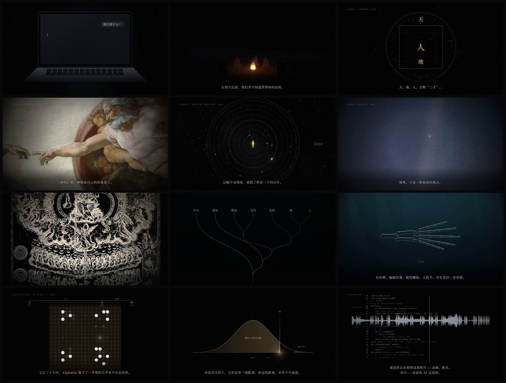

<div align="center">

# Code Films · 代码电影

**Documentary films made entirely in code.** Every frame drawn by a program, the score composed in code, the narration synthesized by AI — all driven by one script file.

**English** · [中文](README.md)

[](LICENSE)
[](https://github.com/IchenDEV/code-films/releases)


</div>

## Films

### Ordinary · 凡人　<sub>~6 min · English / 中文 · 1080p</sub>

> Perhaps science has only ever done one thing: it has brought us down from the altar.

Three dethronements — of our **place** (geocentrism → the pale blue dot), our **origin** (the Great Chain of Being → the tree of life), and our **mind** (*cogito* → AI).

▶ **Watch**: [English](https://github.com/IchenDEV/code-films/releases/download/ordinary-v1.0/ordinary-en.mp4) · [中文](https://github.com/IchenDEV/code-films/releases/download/ordinary-v1.0/ordinary-zh.mp4)　|　[About the film](films/ordinary/)



### AI Is Getting More Capable. Why Are We Getting Busier?　<sub>2m 33s · Chinese · Whiteboard · 1080p</sub>

> Let AI coordinate execution, while people set the direction.

A hand-drawn concept film about asynchronous work, Loop / Graph Engineering, and a steward that adapts the work graph as feedback arrives.

▶ **Watch**: [Chinese whiteboard edition](https://github.com/IchenDEV/code-films/releases/download/ai-steward-v1.0/ai-steward-zh.mp4)　|　[About the film and build commands](films/ai-steward/) · [Chinese article](films/ai-steward/公众号文案.md)

**Concept demonstration; not a recording of a real product.**

### MCP Has Drifted Off Course · MCP 跑偏了　<sub>~2m 40s · Chinese · 1080p</sub>

> Both sides say “supports MCP,” yet they speak different dialects.

A technical essay about authorization, client compatibility, execution sandboxes, and the boundary between capability interfaces and agent runtimes. Two narration voices share one picture source, with separate measured timelines.

▶ **Watch**: [E · Ian](https://github.com/IchenDEV/code-films/releases/download/mcp-v1.0/mcp-E-zh.mp4) · [F · Evan Zhao](https://github.com/IchenDEV/code-films/releases/download/mcp-v1.0/mcp-F-zh.mp4)　|　[Build commands](films/mcp/) · [Chinese article](films/mcp/article.md)

---

## What the pipeline does

| | |
|---|---|
| **One script drives everything** | `script.mjs` holds bilingual narration and the shot list. Shot durations are laid out from the **measured narration**, so rewording a line or changing a voice never means re-timing by hand. |
| **Frames are pure functions** | Each shot is a Canvas 2D function `(ctx, time-in-shot) → frame`: any frame renders on its own, and rendering runs in parallel. |
| **A synth orchestra** | `orchestra.py` synthesizes strings, brass, choir, piano, harp, taiko and timpani with numpy. Each film arranges its score by shot name, so climaxes and silences land on picture. |
| **A sound-effects library** | `dsp.py`: thunder, fire, wind, keys, metal, impacts, whooshes — all synthesized, no sample files. |
| **AI narration** | ElevenLabs, line by line with surrounding context, cached by content (no repeat charges); silence trimmed, speaking rate capped; pronunciation checkable with speech-to-text. |
| **A real mix** | Music ducks under narration, narration sits 7 dB above it; optional hard cuts to digital silence; masters normalized to -16 LUFS. |
| **Archival images** | Public-domain images from Wikimedia Commons with documentary-style pans and zooms; black-and-white engravings can be inverted into glowing lines on black. |

```
script.mjs ─► tts.py ─► vo_trim / vo_pace ─► build_timeline.mjs ─┬─► mix.py (sfx.py + score.py + narration) ─► loudnorm
                                                                 └─► render.mjs (headless Chromium renders shots/) ─► mp4 ─► compress.sh
```

## Quick start

**Requirements**: Node 20+ · Python 3.10+ · ffmpeg · Noto CJK fonts (`apt install fonts-noto-cjk`). Narration also needs a logged-in [ElevenLabs CLI](https://www.npmjs.com/package/@elevenlabs/cli).

```bash
git clone https://github.com/IchenDEV/code-films && cd code-films
npm install && npx playwright install chromium
pip install -r requirements.txt

./run.sh ordinary preview                  # live preview in the browser, with a scrubber
./run.sh ordinary stills en @go+5 @recap   # render any moment of any shot
./run.sh ordinary audio en && ./run.sh ordinary render en   # mix + render (music and effects only, until narration is synthesized)
./run.sh ordinary all                      # narration → timeline → audio → render → compress
```

The repository ships with Ordinary's timelines and processed archival images, so **you can preview and render the picture without any API key**.

| Command | |
|---|---|
| `./run.sh <film> tts [lang]` | Synthesize narration (unchanged lines are skipped) |
| `./run.sh <film> timeline` | Lay out shots from measured narration |
| `./run.sh <film> audio [lang]` | Mix sound effects, score and narration |
| `./run.sh <film> score [lang]` | Render the score alone |
| `./run.sh <film> render [lang]` | Render the picture and mux the audio |
| `./run.sh <film> compress` | Delivery copies: H.265 (~45 MB) and H.264 (~110 MB) |
| `./run.sh <film> stills @shot+sec …` | Spot-check frames |
| `./run.sh <film> check [lang]` | Flag narration lines whose pace or pitch is off |
| `./run.sh <film> preview` | Live preview |
| `./run.sh new <name>` | Start a new film from the template |

## Making your own film

```bash
./run.sh new my-film && ./run.sh my-film timeline && ./run.sh my-film preview
```

```
films/my-film/
├── film.json      languages, output names, narration voices, pace caps, images to preload
├── script.mjs     narration and shot list
├── shots/*.js     shot functions (include them in index.html)
├── score.py       score
├── sfx.py         sound effects
├── events.mjs     (optional) events inside shots: lightning, cut points, on-screen typing…
└── img/           (optional) archival images
```

**`script.mjs`**

```js
export const LINES = {            // one id per line; array order follows film.json → languages
  l1: ['每一部片子，都从一句话开始。', 'Every film begins with a single line.'],
  l2: ['把它写进 script.mjs。', 'Write it in script.mjs.'],
};
export const LABELS = { title: ['新片', 'NEW FILM'] };
export const SHOTS = [
  { kind: 'stars', lines: ['l1', 'l2'], lead: 1.5, gap: 0.8, tail: 2, min: 8 },
  { kind: 'title', lines: [], min: 5, label: 'title', xf: 1.2 },
];
```

Shot fields: `kind` (shot function), `lines`, `lead` / `gap` / `tail` (pauses), `min`, `xf` (crossfade; `0` = cut), `caption`, `label` (`title` = film title), `silenceBefore`, `hardOut`.

**A shot function**

```js
// u: time within the shot; sh[lineId]: when that line starts within the shot
SHOT.stars = (ctx, u, dur, sh) => {
  drawStars(ctx, u, ease(u, 0, 2), H * 0.7 + u * 6);
  glow(ctx, CX, CY, 160, [255, 220, 170], 0.5 * ease(u, sh.l2, sh.l2 + 1.5));
};
```

The engine (`engine/web/`) provides timing curves (`ease`, `win`, `lerp`…), deterministic noise (`rand`, `noise1/2`, `fbm1/2`), drawing helpers (`glow`, `splinePath`, `polyProgress`), motifs (`drawStars`, `drawFire`, `drawProfile`, `standingPath`, `fillHand`), and `kenburns()` for archival images. Subtitles, captions, labels, grain and vignette are drawn by the engine.

**`score.py`** — `from orchestra import *`, build a `Score`, place `chord` / `melody` / instrument hits by shot time, return a stereo array.

**`sfx.py`** — executed by the mixer with `dsp.py` in scope: `add(fx | dry, time, sound, pan, gain)`, shot times via `span` / `at` / `end`, sounds like `pink`, `whoosh`, `boom`, `landing`; set `HARD = (start, end)` for a hard cut to silence.

See the [中文 README](README.md) for a field-by-field reference, and [docs/WORKFLOW.md](docs/WORKFLOW.md) for the full process and lessons learned.

## Performance

On a 4-core machine without a GPU, rendering runs at ~10 fps — about 15 minutes per language for a 6-minute film. The master keeps its film grain (~1.7 GB); the H.265 delivery copy is ~45 MB with no visible difference.

## License

Code is [MIT](LICENSE)-licensed. Ordinary's archival images are in the public domain; fonts and voices are listed in [films/ordinary/CREDITS.md](films/ordinary/CREDITS.md).
