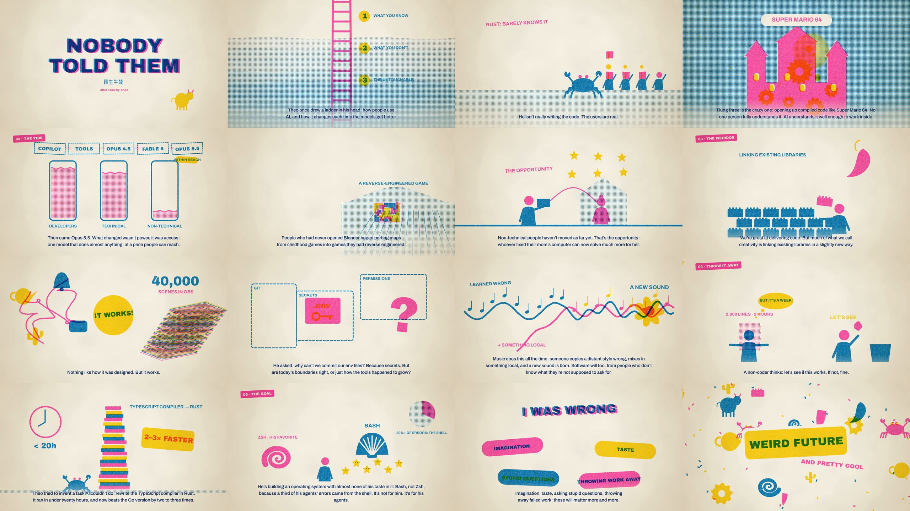

<div align="center">

# 代码电影 · Code Films

**用代码做纪录片。** 画面逐帧由程序绘制，配乐由代码作曲，旁白由 AI 合成，一份脚本驱动一切。

[English](README.en.md) · **中文**

[](LICENSE)
[](https://github.com/IchenDEV/code-films/releases)


</div>

## 影片

### 凡人 · Ordinary　<sub>约 6 分钟 · 中文 / English · 1080p</sub>

> 科学所做的，或许只有一件事：把我们，从神坛上请下来。

三重退位：**位置**（地心说 → 暗淡蓝点）、**起源**（存在巨链 → 生命之树）、**心智**（我思故我在 → AI）。

▶ **观看**：[中文版](https://github.com/IchenDEV/code-films/releases/download/ordinary-v1.0/ordinary-zh.mp4) · [English](https://github.com/IchenDEV/code-films/releases/download/ordinary-v1.0/ordinary-en.mp4)　|　[关于这部片子](films/ordinary/)


### AI 越来越能干，人为什么越来越忙？　<sub>2 分 33 秒 · 中文 · 白板手绘 · 1080p</sub>

> 让 AI 协调执行，让人掌握方向。

从多源异步触发，到 Loop / Graph，再到随反馈变化的“大管家”。这是一支介绍工作组织方式的概念短片。

▶ **观看**：[白板版](https://github.com/IchenDEV/code-films/releases/download/ai-steward-v1.0/ai-steward-zh.mp4)　|　[关于这部片子与制作入口](films/ai-steward/) · [公众号文案](films/ai-steward/公众号文案.md)

**概念演示，非产品实录。**

### MCP 跑偏了　<sub>约 2 分 40 秒 · 中文 · 1080p</sub>

> 两边都写着“支持 MCP”，说的却是两种方言。

从“AI 应用的 Type-C”到授权、支持矩阵与执行沙箱，一支关于接口与运行框架边界的技术短片。两种旁白共用同一份画面源码，各自保存实测时间轴。

▶ **观看**：[E · Ian](https://github.com/IchenDEV/code-films/releases/download/mcp-v1.0/mcp-E-zh.mp4) · [F · Evan Zhao](https://github.com/IchenDEV/code-films/releases/download/mcp-v1.0/mcp-F-zh.mp4)　|　[制作入口](films/mcp/) · [原文](films/mcp/article.md)

### 放手 · Letting Go　<sub>约 4 分钟 · 中文 / English · 水墨 · 1080p</sub>

> 模型越强，我们越该少替它安排每一步，多把值得完成的事，交代清楚。

一部关于提示词演进的水墨短片，通篇没有一块屏幕、一行代码。朱红是人的指导：描红、告示、引线、印章；墨色是模型自己的笔：先描，再跟，最后自己写。八个阶段，从 2019 年的续写，到嘱咐、步骤、补丁、推理、上下文，再到 2026 年的放手与今后；每一段都在画面上写出那个年代的真实提示词。

▶ **观看**：[中文版](https://github.com/IchenDEV/code-films/releases/download/letting-go-v1.0/letting-go-zh.mp4) · [English](https://github.com/IchenDEV/code-films/releases/download/letting-go-v1.0/letting-go-en.mp4)　|　[关于这部片子与制作入口](films/letting-go/) · [公众号文案](films/letting-go/公众号文案.md)

### 初生牛犊 · Nobody Told Them　<sub>约 4 分钟 · 中文 / English · 孔版印刷 · 1080p</sub>

> 未来会很怪。也许，还很酷。
> *The future is going to be weird. And probably pretty cool.*

从 AI 帮你做熟悉的事，到替你进入更深的系统，再到让不懂技术的人也能造出真实作品——这是一部根据 Theo（t3.gg）演讲改编的孔版印刷小册子风格短片，记录那些“不会”反而成为优势的时刻。

▶ **观看**：[中文版](https://github.com/IchenDEV/code-films/releases/download/nobody-told-them-v1.0/nobody-told-them-zh.mp4) · [English](https://github.com/IchenDEV/code-films/releases/download/nobody-told-them-v1.0/nobody-told-them-en.mp4)　|　[关于这部片子与制作入口](films/nobody-told-them/)



### 编制 · Headcount　<sub>4:38 中文 · 5:17 English · 纸艺拼贴 · 1080p</sub>

> 任务应当催生组织，而不是编制滋生任务。
> *Let the work create the team. Not the headcount create the work.*

一部反对 AI 官僚主义的双语短片：任务需要时再派生执行实例，结束后回收；只有并行读取、独立复核或权限隔离确有收益时才拆分，同时警惕调度者自己长成新的管理层。

▶ **观看**：[中文版](https://github.com/IchenDEV/code-films/releases/download/headcount-v1.0/headcount-zh.mp4) · [English](https://github.com/IchenDEV/code-films/releases/download/headcount-v1.0/headcount-en.mp4)　|　[关于这部片子与制作入口](films/headcount/)


### 五年 · 从写代码，到让 AI 指挥 AI　<sub>5:09 中文 · 5:29 English · 竖屏短版 1:23 · 光影渲染 · 1080p</sub>

> 从开发者亲自操作代码，到 Agent 自主组织软件开发：这条路是怎么一步一步走过来的。

只讲截至 2026 年 10 月已经发生的事：Tab 补全、对话改代码、Agent 接管任务、同时开十个、人成了瓶颈，再到协调 Agent 动态组织执行者。多 Agent 编排 2024 年就有了，2026 年变的是执行者终于靠得住了。一份脚本出六个平台版本：B 站、YouTube、抖音、小红书、视频号、YouTube Shorts；第一帧就开口，配乐与音效由 ElevenLabs 生成。

[关于这部片子与制作入口](films/five-years/) · [各平台发布文案](films/five-years/发布文案.md)


---

## 这套工作流能做什么

| | |
|---|---|
| **一份脚本决定一切** | `script.mjs` 写双语旁白和镜头表。镜头时长由**实测的旁白长度**自动排出，改一句词、换一个声音都不用手动对时间。 |
| **画面是纯函数** | 每个镜头是 `(ctx, 镜头内时间) → 画面` 的 Canvas 2D 函数：任意一帧都能单独渲染，可以多进程并行出片。 |
| **一支合成乐团** | `orchestra.py` 用 numpy 合成弦乐、铜管、合唱、钢琴、竖琴、太鼓、定音鼓……片子按镜头名编曲，高潮与静默和画面对位。 |
| **音效库** | `dsp.py`：雷、火、风、键盘、金属、落地、气流……全部程序合成，无需素材文件。 |
| **AI 旁白** | ElevenLabs 逐句合成（带上下句语境、按内容缓存不重复计费），自动修剪静音、限制语速；可用语音转写核对发音。 |
| **专业的混音** | 说话时音乐自动退让，旁白高于音乐 7 dB；可设“硬切”成纯静音；成品标准化到 -16 LUFS。 |
| **档案图** | 从 Wikimedia Commons 下载公有领域图像，纪录片式缓推缓移，黑白版画可反相成“黑底发光线条”。 |

```
script.mjs ─► tts.py ─► vo_trim / vo_pace ─► build_timeline.mjs ─┬─► mix.py (sfx.py + score.py + 旁白) ─► loudnorm
 旁白+镜头表   ElevenLabs   修剪静音、控语速      按实测时长排镜头       │
                                                                 └─► render.mjs (Chromium 逐帧渲染 shots/) ─► mp4 ─► compress.sh
```

## 快速开始

**依赖**：Node 20+ · Python 3.10+ · ffmpeg · Noto CJK 字体（Debian/Ubuntu：`apt install fonts-noto-cjk`）
合成旁白另需已登录的 [ElevenLabs CLI](https://www.npmjs.com/package/@elevenlabs/cli)（`npm i -g @elevenlabs/cli`）。

```bash
git clone https://github.com/IchenDEV/code-films && cd code-films
npm install && npx playwright install chromium
pip install -r requirements.txt

./run.sh ordinary preview               # 浏览器里实时预览《凡人》，可拖动进度条
./run.sh ordinary stills zh @go+5 @recap # 渲染任意镜头的任意时刻 → films/ordinary/out/stills/
./run.sh ordinary audio zh && ./run.sh ordinary render zh   # 混音并渲染整片（没合成旁白时只有音乐与音效）
```

仓库里带着《凡人》排好的时间轴与处理好的档案图，**不需要任何 API 也能预览和渲染画面**。完整重建：

```bash
./run.sh ordinary all     # 旁白 → 时间轴 → 混音 → 渲染 → 压缩
```

| 命令 | 作用 |
|---|---|
| `./run.sh <片名> tts [语言]` | 合成旁白；文本没变的句子会跳过 |
| `./run.sh <片名> timeline` | 按实测旁白时长排镜头 |
| `./run.sh <片名> audio [语言]` | 音效 + 配乐 + 旁白混音 |
| `./run.sh <片名> score [语言]` | 只渲染配乐，单独试听 |
| `./run.sh <片名> render [语言]` | 渲染画面并合成音轨 |
| `./run.sh <片名> compress` | 压缩交付版：H.265（约 45 MB）+ H.264（约 110 MB） |
| `./run.sh <片名> stills @镜头+秒 …` | 截帧检查 |
| `./run.sh <片名> check [语言]` | 旁白逐句语速、音高是否离群 |
| `./run.sh <片名> preview` | 实时预览 |
| `./run.sh new <片名>` | 从模板新建一部片子 |

## 做一部你自己的片子

```bash
./run.sh new my-film          # 复制 films/_template
./run.sh my-film timeline     # 先用估算时长排一版
./run.sh my-film preview      # 边写边看
```

一部片子就是一个目录：

```
films/my-film/
├── film.json      配置：语言、输出文件名、旁白声音、语速上限、要预载的图片
├── script.mjs     旁白与镜头表
├── shots/*.js     镜头函数（在 index.html 里引入）
├── score.py       配乐
├── sfx.py         音效
├── events.mjs     （可选）镜头内的事件：闪电时刻、剪辑点、屏幕打字……
└── img/           （可选）档案图
```

### 1. `script.mjs`：旁白与镜头表

```js
export const LINES = {            // 每句一个 id；数组顺序同 film.json 的 languages
  l1: ['每一部片子，都从一句话开始。', 'Every film begins with a single line.'],
  l2: ['把它写进 script.mjs。', 'Write it in script.mjs.'],
};
export const CAPTIONS = { sky: ['星空 · 2026', 'The sky · 2026'] };   // 左上角的小字说明
export const LABELS = { one: ['第一章', 'CHAPTER I'], title: ['新片', 'NEW FILM'] };

export const SHOTS = [
  { kind: 'stars', lines: ['l1', 'l2'], lead: 1.5, gap: 0.8, tail: 2, min: 8, caption: 'sky', label: 'one' },
  { kind: 'title', lines: [], min: 5, label: 'title', xf: 1.2 },
];
```

| 镜头字段 | 含义 |
|---|---|
| `kind` | 镜头函数名，对应 `SHOT[kind]` |
| `lines` | 这个镜头里依次念出的旁白 id |
| `lead` / `gap` / `tail` | 第一句前、句与句之间、最后一句后的留白（秒） |
| `min` | 最短时长；没有旁白的镜头靠它决定长度 |
| `xf` | 与上一个镜头的叠化时长；`0` 为硬切 |
| `caption` | 档案图说明（`CAPTIONS` 里的 id） |
| `label` | 章节标签，在镜头结尾出现；`title` 是片名，居中、更大 |
| `silenceBefore` | 与上一镜头之间留出的黑场（秒） |
| `hardOut` | 镜头结束时硬切（配合 `sfx.py` 的 `HARD` 做成纯静音） |

### 2. 镜头函数：`shots/*.js`

```js
// u：镜头内时间（秒）；dur：镜头时长；sh[句子id]：这句旁白在镜头内开始的时刻
SHOT.stars = (ctx, u, dur, sh) => {
  drawStars(ctx, u, ease(u, 0, 2), H * 0.7 + u * 6);            // 星空，2 秒内淡入
  const k = ease(u, sh.l2, sh.l2 + 1.5);                         // 第二句开始时……
  glow(ctx, CX, CY, 160, [255, 220, 170], 0.5 * k);              // ……中央亮起一点光
};
```

引擎提供的常用工具（`engine/web/`）：

| | |
|---|---|
| 常量 | `W` `H`（1920×1080）、`CX` `CY`、`TAU` |
| 时间曲线 | `ease(t, a, b)`、`win(t, a, b, 淡入, 淡出)`、`ramp`、`lerp`、`clamp`、`easeInOut` |
| 随机与噪声 | `rand(i, j)`（确定性）、`noise1`、`noise2`、`fbm1`、`fbm2` |
| 绘制 | `glow()` 光晕、`splinePath()` 平滑曲线、`polyProgress()` 折线逐步描出 |
| 母题 | `drawStars` 星空、`drawFire` / `drawEmbers` 火与余烬、`drawProfile` 侧脸、`seatedPath` / `standingPath` 人物剪影、`fillHand` 手 |
| 档案图 | `kenburns(ctx, 图名, 进度, [cx, cy, 可见高度比], [...])`：缓推缓移，返回图像坐标 → 屏幕坐标的映射 |
| 字体 | `SERIF` `SANS` `MONO` `LATIN` `TYPEWRITER` |

字幕、档案图说明、章节标签、胶片颗粒和暗角由引擎统一绘制，镜头只管画面本身。

### 3. 配乐：`score.py`

```python
from orchestra import *   # 乐器与编曲工具

def build_score(TL):                       # 返回与时间轴等长的立体声数组
    S = {s['kind']: s for s in TL['shots']}
    sc = Score(TL['DURATION'])
    a, b = S['stars']['a'], S['stars']['b']
    sc.chord(a, 'Dm', b - a, 'str', 0.5)                          # 弦乐和弦
    sc.melody(a + 2, 1.0, [('A4', 2), ('D5', 2), ('C5', 4)], 'pno', 0.45)  # 钢琴旋律
    sc.put('drm', S['title']['a'], taiko(0.9, big=True))         # 片名处一声太鼓
    out = reverb(sc.mix(), 4.0, 0.35)[: int(TL['DURATION'] * SR)]
    return out / np.max(np.abs(out)) * 0.9
```

乐器：`strings` `brass` `choir` `piano` `harp` `taiko` `timpani` `braam` `crash` `cymbal_swell` `pulse_note` `arp_note`；和弦名见 `CHORDS`（`Dm` `Bb` `F` `C` `Gm` `Asus` `D5`……），音名如 `'D4'`、`'Bb3'`。

### 4. 音效：`sfx.py`

`sfx.py` 由混音程序直接执行，`engine/pipeline/dsp.py` 的名字都可以直接用：

```python
a, b = span('stars')                                   # 镜头的起止时刻
n = idx(b) - idx(a)
add(fx, a, bp(pink(n), 200, 1200) * 0.06, -0.2)       # 一层风声，写进带混响的 fx 总线
add(dry, at('stars', 'l2'), boom(46, 4, 1.2), 0, 0.4)  # 第二句旁白开始时一声低沉的 boom
HARD = (end('stars') - 0.5, end('stars'))             # （可选）这一段清成纯静音
```

总线：`fx`（带空间混响）、`dry`（干声）；时刻：`span` `at` `end`；声音：`pink` `brown` `noise` `lp` `hp` `bp` `click` `boom` `metal` `whoosh` `fire_layer` `landing` `bell` `pluck` `pad`。

### 5. `film.json`

```json
{
  "id": "my-film",
  "languages": ["zh", "en"],
  "output": { "zh": "我的片子", "en": "MyFilm" },
  "breath": { "zh": 0.15, "en": 0.08 },
  "narration": {
    "zh": { "voice": "<ElevenLabs voice id>", "model": "eleven_v4", "languageCode": "zh",
            "settings": { "stability": 0.4, "similarity_boost": 0.8, "speed": 0.95 }, "paceCap": 4.4 },
    "en": { "voice": "<ElevenLabs voice id>", "model": "eleven_v4",
            "settings": { "stability": 0.5, "similarity_boost": 0.8, "speed": 0.9 }, "paceCapRelative": 1.12 }
  },
  "images": ["paleblue"]
}
```

`breath` 是句与句之间额外的呼吸；`paceCap` 是语速上限（中文按字/秒），`paceCapRelative` 是相对中位语速的上限；`images` 列出 `img/*.jpg` 中要预载的图。

## 性能与小贴士

- **渲染**：4 核、无 GPU 的机器约 10 帧/秒，6 分钟的片子中英文各约 15 分钟。`render.mjs` 第二个参数是并行进程数。
- **体积**：母版保留了胶片颗粒，约 1.7 GB；`compress` 出的 H.265 版约 45 MB，肉眼几乎无差别。
- **改词**：只改 `script.mjs` → `tts`（只重新合成改动的句子）→ `timeline` → `audio` → `render`。
- **挑声音**：一定要放进完整混音里试听，干声和成片里的感觉差别很大。更多经验见 [docs/WORKFLOW.md](docs/WORKFLOW.md)。
- **飞书交付**（可选）：`engine/pipeline/deliver_lark.sh`，需要已登录的 `lark-cli`，通过环境变量 `LARK_USER_ID` / `LARK_FOLDER` 配置。

## 目录

```
engine/web/          画面引擎：core（光晕、噪声、颗粒）· text（字幕与标签）· archive（档案图）· assets（母题）· main（调度与预览）
engine/pipeline/     流水线：tts · vo_trim · vo_pace · vo_check · build_timeline · mix · dsp · orchestra · render · stills · compress …
films/ordinary/      《凡人》
films/ai-steward/    《AI 越来越能干，人为什么越来越忙？》· HyperFrames 白板版
films/mcp/           《MCP 跑偏了》· HyperFrames · E/F 两种旁白
films/letting-go/    《放手》· 水墨 · 中英双语
films/nobody-told-them/ 《初生牛犊》· 孔版印刷 · 中英双语
films/headcount/     《编制》· 纸艺拼贴 · 中英双语
films/_template/     新片模板
docs/WORKFLOW.md     工作流与踩过的坑
run.sh               ./run.sh <片名> <步骤>
```

## 授权

代码以 [MIT](LICENSE) 授权。《凡人》中的档案图均为公有领域，字体与旁白声音的来源见 [films/ordinary/CREDITS.md](films/ordinary/CREDITS.md)。
