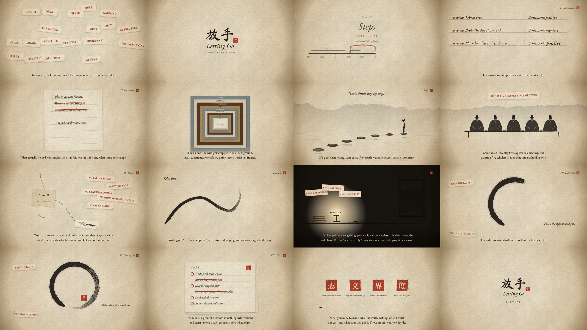

# 放手 · Letting Go

> 模型越强，我们越该少替它安排每一步，多把值得完成的事，交代清楚。
> *The stronger the model, the less we should plan its every step, and the more clearly we should say what is worth doing.*

About 4 minutes (Chinese 3:42, English 4:06), in Chinese and English. Narrated via ElevenLabs by Pangge (Chinese) and Michael Dan (English), both on Eleven v4. Based on the essay 《提示词演进史：从教 AI 接下一句话，到把一件事交给它》.



The film tells the history of prompting without a single screen or line of code. Everything happens on rice paper, in two inks:

- **Vermilion is the human's guidance.** Copybook tracing, pasted warning notes, red guide lines, seals.
- **Black ink is the model's own hand.** It traces, then follows, then writes on its own.
- **The paper is what the model can see.** In the lamp scene, it only knows the part of the room the light reaches.

Before each part, a timeline card brushes one long history line from 2019 onward; it grows by one segment each time, with the current era in vermilion. Every part shows a real example of the prompting style it describes.

| Part | Years | Example on screen | Picture |
|---|---|---|---|
| Cold open | | 必须 · 严禁 · 再次强调 | A sheet papered over with warning notes; the boundary between a seal and an ink circle |
| 一 · 续写 Continuation | 2019–2022 | 评论：…… 情绪：正面 / 负面 / ▢ | A copybook: examples traced red-to-black, one blank, then the natural next stroke |
| 二 · 嘱咐 Instructions | 2022–2023 | "你是一位拥有二十年经验的世界顶级专家" struck out; who it is for, what for, what must not change | An eight-line letter; a one-line wish inside ten frames labelled 角色、背景、目标…… |
| 三 · 步骤 Steps | 2022–2024 | "让我们一步一步地思考" · "请扮演五位专家" | Stepping stones, branching paths, five scholars who turn out to be one |
| 四 · 补丁 Patches | 2023–2024 | 严禁解释 · 只许输出标签 · ' → " breaks O'Connor | Each patch opens a new crack; the mount keeps the shape, a seal still approves |
| 五 · 推理 Reasoning | 2024–2025 | 第一步、第二步 → 解决这个问题 | The red guide fades and the brush continues alone |
| 六 · 上下文 Context | 2025 | 认真阅读！×3 · old plans vs new plans | A lamp only shows part of the room |
| 七 · 放手 Letting Go | 2026 | 绝对不许写注释 → 照着周围已有的写法来 | One ensō: the brush stops halfway, the old rules fall, and on "更好的那一笔" the same stroke closes the circle |
| 八 · 今后 Next | | A third draft, rules kept or struck in vermilion | Then four seals for what stays with the person, and a freehand mountain |

## Making this film

```bash
./run.sh letting-go preview        # live preview
./run.sh letting-go tts            # narration (needs a logged-in elevenlabs CLI)
python3 pauses.py zh               # shorten over-long silences inside Chinese lines (no time-stretching)
python3 cues.py                    # forced-align the climax word → timing/cues.json
./run.sh letting-go timeline       # lay out shots from the measured narration lengths
./run.sh letting-go audio          # sound effects + score + narration
./run.sh letting-go render         # → out/放手.mp4, out/LettingGo.mp4
./run.sh letting-go compress       # delivery copies H.265 / H.264
```

The subset fonts are already in `fonts/`. To rebuild them, run `./make_fonts.sh` with fonttools installed.

## Files

| File | Content |
|---|---|
| `film.json` | Languages, output filenames, narration voices and parameters |
| `script.mjs` | Bilingual narration, chapter inscriptions, shot list |
| `style.js` | The paper, brush strokes with dry-brush streaks, seals, pasted notes, ink-coloured subtitles and post-processing. It overrides the engine's dark-background text and grain |
| `shots/opening.js` | Notes, boundary, title |
| `shots/era.js` | Timeline cards with the growing history line |
| `shots/chapters.js` | Copybook, letter, frames, stones, scholars, patches with the O'Connor card, hanging scroll |
| `shots/closing.js` | Reasoning, lamp, the ensō climax, drafts, seals, freehand mountain, end card |
| `cues.py`, `events.mjs`, `timing/cues.json` | Character-level alignment of the climax word, written into the timeline so picture, score and sound hit it together |
| `pauses.py` | Shortens over-long pauses inside Chinese narration lines |
| `score.py` | Pentatonic score on D: zither-like harp, strings, piano, choir |
| `sfx.py` | Stamps, brush, paper, water drops, wood, cracks, lamp flame |
| `make_fonts.sh` | Downloads and subsets the three open-licensed fonts |
